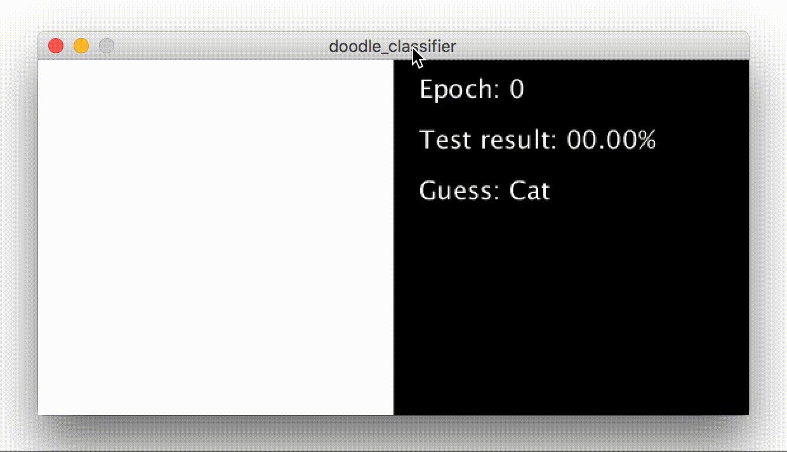

# Doodle classifier
This is an example of how the [Basic Neural Network Library](https://github.com/kim-marcel/basic_neural_network) can be used.

The Neural Network can be trained and tested with a given dataset consisting of images of cats, clouds and smileys from the [Google Quick Draw](https://quickdraw.withgoogle.com) dataset. After enough training it should be possible to classify your own drawings correctly.

This project is based on [this](https://www.youtube.com/watch?v=pqY_Tn2SIVA&list=PLRqwX-V7Uu6Zs14zKVuTuit6jApJgoYZQ) playlist from the Youtube-channel "The Coding Train" by Daniel Shiffman.

If you want to learn more about Neural Networks check out these YouTube-playlists:
- [Neural Networks - The Nature of Code](https://www.youtube.com/watch?v=XJ7HLz9VYz0&list=PLRqwX-V7Uu6aCibgK1PTWWu9by6XFdCfh) by The Coding Train (Daniel Shiffman)
- [Neural Networks](https://www.youtube.com/watch?v=aircAruvnKk&list=PLZHQObOWTQDNU6R1_67000Dx_ZCJB-3pi) by 3Blue1Brown

## Demo

## How to use
Draw your own doodle on the left half of the canvas. It will be identified immediately.

Keyboard-shortcuts:
- 'r': Train the NN for one epoch with the training data
- 'e': Test the NN with the testing data
- 'd': Clear canvas
